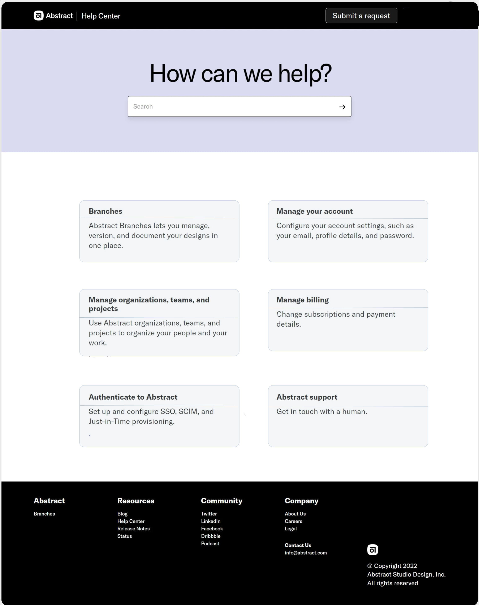

## React Assignment

1. How can you implement shared functionality across a component tree?

2. Why is the `useState` hook appropriate for handling state in a complex component?

3. Design a user interface resembling the provided page. Fetch the data from the server and dynamically map the information cards to the fetched data. Ensure that the search functionality is also implemented.

